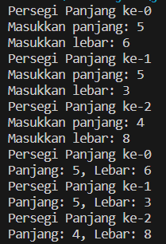
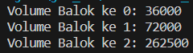
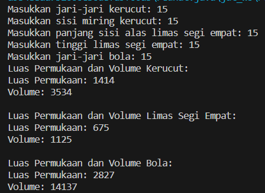
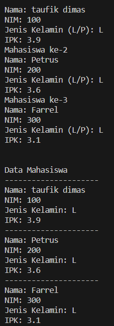

# <p align="center">JOBSHEET III - ARRAY OF OBJEK</p>

<br><br>

<p align="center">
 


</p>

<br><br>

<p align="center">
    Nama : Taufik Dimas Edystara <br>
    NIM : 2341720062 <br>
    Kelas : TI-1B <br>
    Prodi : D4 Teknik Informatika
</p>

***

## **3.2 Percobaan 1: Membuat Array dari Object, Mengisi dan Menampilkan**
### **3.2.1 Langkah-langkah Percobaan**
```java
public class PersegiPanjang_26 {
    public int panjang;
    public int lebar;
}
```
```java
public class ArrayObjects_26 {
    public static void main(String[] args) {
        PersegiPanjang_26[] ppArray = new PersegiPanjang_26[3];

        ppArray[0] = new PersegiPanjang_26();
        ppArray[0].panjang = 110;
        ppArray[0].lebar = 30;

        ppArray[1] = new PersegiPanjang_26();
        ppArray[1].panjang = 80;
        ppArray[1].lebar = 40;

        ppArray[2] = new PersegiPanjang_26();
        ppArray[2].panjang = 100;
        ppArray[2].lebar = 20;

        System.out.println("Persegi Panjang ke-0, panjang: " + ppArray[0].panjang + ", lebar: " + ppArray[0].lebar);
        System.out.println("Persegi Panjang ke-1, panjang: " + ppArray[1].panjang + ", lebar: " + ppArray[1].lebar);
        System.out.println("Persegi Panjang ke-2, panjang: " + ppArray[2].panjang + ", lebar: " + ppArray[2].lebar);
    }
}
```
### **3.2.2 Verifikasi Hasil Percobaan**


### **3.2.3 Pertanyaan**
```1. Berdasarkan uji coba 3.2, apakah class yang akan dibuat array of object harus selalu memiliki atribut dan sekaligus method?Jelaskan!```<br>

```2. Apakah class PersegiPanjang memiliki konstruktor?Jika tidak, kenapa dilakukan pemanggilan konstruktur pada baris program berikut :```
``` java
ppArray[1] = new PersegiPanjang_26();
```

```3. Apa yang dimaksud dengan kode berikut ini:```
``` java
PersegiPanjang_26[] ppArray = new PersegiPanjang_26[3];
```

```4. Apa yang dimaksud dengan kode berikut ini:```<br>
```java
 ppArray[1] = new PersegiPanjang_26();
        ppArray[1].panjang = 80;
        ppArray[1].lebar = 40;
```

## **3.3 Percobaan 2: Menerima Input Isian Array Menggunakan Looping**
### **3.3.1 Langkah-langkah Percobaan**
``` java
import java.util.Scanner;

public class ArrayObjects_26 {
    public static void main(String[] args) {
        PersegiPanjang_26[] ppArray = new PersegiPanjang_26[3];
        Scanner sc = new Scanner(System.in);

        for (int i = 0; i < 3; i++) {
            ppArray[i] = new PersegiPanjang_26();
            System.out.println("Persegi Panjang ke-" + i);
            System.out.print("Masukkan panjang: ");
            ppArray[i].panjang = sc.nextInt();
            System.out.print("Masukkan lebar: ");
            ppArray[i].lebar = sc.nextInt();
        }

        for (int i = 0; i < 3; i++) {
            System.out.println("Persegi Panjang ke-" + i);
            System.out.println("Panjang: " + ppArray[i].panjang + ", Lebar: " + ppArray[i].lebar);
        }
    }
}
```
### **3.3.2 Verifikasi Hasil Percobaan**


### **3.3.3 Pertanyaan**

```1. Apakah array of object dapat diimplementasikan pada array 2 Dimensi?```

```2. Jika jawaban soal no satu iya, berikan contohnya! Jika tidak, jelaskan!```

```3. Jika diketahui terdapat class Persegi yang memiliki atribut sisi bertipe integer, maka kode dibawah ini akan memunculkan error saat dijalankan. Mengapa?```

``` java
Persegi[] pgArray = new Persegi[100];
phArray[5].sisi = 20;
 ```

```4. Modifikasi kode program pada praktikum 3.3 agar length array menjadi inputan dengan Scanner!```

```5. Apakah boleh Jika terjadi duplikasi instansiasi array of objek, misalkan saja instansiasi dilakukan pada ppArray[i] sekaligus ppArray[0]?Jelaskan !```

## **3.4 Percobaan 3: Penambahan Operasi Matematika di Dalam Method**
### **3.4.1 Langkah-langkah Percobaan**
``` java
package ArrayBalok;

public class ArrayBalok {

    public static void main(String[] args) {
        Balok_26 blArray[] = new Balok_26[3];

        blArray[0] = new Balok_26(100, 30, 12);
        blArray[1] = new Balok_26(120, 40, 15);
        blArray[2] = new Balok_26(210, 50, 25);

        for (int i = 0; i < 3; i++) {
            System.out.println("Volume Balok ke " + i + ": " + blArray[i].hitungVolume());
        }
    }

}
```
``` java
package ArrayBalok;

public class Balok_26 {
    public int panjang;
    public int lebar;
    public int tinggi;

    public Balok_26(int p, int l, int t) {
        panjang = p;
        lebar = l;
        tinggi = t;
    }

    public int hitungVolume() {
        return panjang * lebar * tinggi;
    }
}
```
### **3.4.2 Verifikasi Hasil Percobaan**


### **3.4.3 Pertanyaan**

```1. Dapatkah konstruktor berjumlah lebih dalam satu kelas? Jelaskan dengan contoh!```
```2. Jika diketahui terdapat class Segitiga seperti berikut ini:Tambahkan konstruktor pada class Segitiga tersebut yang berisi parameter int a, int t yang masing-masing digunakan untuk mengisikan atribut alas dan tinggi. ```
``` java
public class Segitiga{
    public int alas;
    public int tinggi;
}
```
```3. Tambahkan method hitungLuas() dan hitungKeliling() pada class Segitiga tersebut. Asumsi segitiga adalah segitiga siku-siku. (Hint: Anda dapat menggunakan bantuan library Math pada Java untuk mengkalkulasi sisi miring) ```<br>
```4. Pada fungsi main, buat array Segitiga sgArray yang berisi 4 elemen, isikan masing-masing atributnya sebagai berikut:```<br>
```sgArray ke-0 alas: 10, tinggi: 4 ```<br>
```sgArray ke-1 alas: 20, tinggi: 10```<br>
```sgArray ke-2 alas: 15, tinggi: 6```<br>
```sgArray ke-3 alas: 25, tinggi: 10```<br>
```5. Kemudian menggunakan looping, cetak luas dan keliling dengan cara memanggil method hitungLuas() dan hitungKeliling().```<br>

## **3.5 Latihan Praktikum**
### **1. Buatlah program yang dapat menghitung luas permukaan dan volume bangun ruang kerucut, limas segi empat sama sisi, dan bola**
```class Kerucut```
``` java 
package BangunRuang;

public class Kerucut_26 {
    public double jariJari;
    public double sisiMiring;

    public Kerucut_26(double jariJari, double sisiMiring) {
        this.jariJari = jariJari;
        this.sisiMiring = sisiMiring;
    }

    public double LuasPermukaan() {
        return Math.PI * jariJari * (jariJari + sisiMiring);
    }

    public double Volume() {
        return (Math.PI * jariJari * jariJari * sisiMiring) / 3;
    }
}
```
```class limas Segi Empat Sama Sisi```
``` java 
package BangunRuang;

public class limasSegiEmpat_26 {
    double panjangSisiAlas;
    double tinggiLimas;

    public limasSegiEmpat_26(double panjangSisiAlas, double tinggiLimas) {
        this.panjangSisiAlas = panjangSisiAlas;
        this.tinggiLimas = tinggiLimas;
    }

    double hitungLuasPermukaan() {
        return panjangSisiAlas * panjangSisiAlas + 4 * (0.5 * panjangSisiAlas * tinggiLimas);
    }

    double hitungVolume() {
        return (panjangSisiAlas * panjangSisiAlas * tinggiLimas) / 3;
    }
}
```
```class Bola```
``` java
package BangunRuang;

public class Bola_26 {
    double jariJariB;

    public Bola_26(double jariJari) {
        this.jariJariB = jariJari;
    }

    public double hitungLuasPermukaan() {
        return 4 * Math.PI * Math.pow(jariJariB, 2);
    }

    public double hitungVolume() {
        return (4.0 / 3.0) * Math.PI * Math.pow(jariJariB, 3);
    }

}
```
```main Bangun Ruang```
``` java
package BangunRuang;

import java.util.Scanner;

public class Main {
    public static void main(String[] args) {
        Scanner sc = new Scanner(System.in);

        // Input Kerucut
        System.out.print("Masukkan jari-jari kerucut: ");
        double jariJari = sc.nextDouble();
        System.out.print("Masukkan sisi miring kerucut: ");
        double sisiMiring = sc.nextDouble();

        Kerucut_26 kerucut = new Kerucut_26(jariJari, sisiMiring);

        // Input Limas Segi Empat
        System.out.print("Masukkan panjang sisi alas limas segi empat: ");
        double panjangSisiAlas = sc.nextDouble();
        System.out.print("Masukkan tinggi limas segi empat: ");
        double tinggiLimas = sc.nextDouble();

        limasSegiEmpat_26 limas = new limasSegiEmpat_26(panjangSisiAlas, tinggiLimas);

        // Input Bola
        System.out.print("Masukkan jari-jari bola: ");
        double jariJariB = sc.nextDouble();

        Bola_26 bola = new Bola_26(jariJariB);

        //hasil perhitungan
        System.out.println("Luas Permukaan dan Volume Kerucut:");
        System.out.println("Luas Permukaan: " + Math.round(kerucut.LuasPermukaan()));
        System.out.println("Volume: " + Math.round(kerucut.Volume()));

        System.out.println("\nLuas Permukaan dan Volume Limas Segi Empat:");
        System.out.println("Luas Permukaan: " + Math.round(limas.hitungLuasPermukaan()));
        System.out.println("Volume: " + Math.round(limas.hitungVolume()));

        System.out.println("\nLuas Permukaan dan Volume Bola:");
        System.out.println("Luas Permukaan: " + Math.round(bola.hitungLuasPermukaan()));
        System.out.println("Volume: " + Math.round(bola.hitungVolume()));

        sc.close();
    }
}
```
### ** Verifikasi Hasil Percobaan**


### **2. program untuk menampilkan informasi mahasiswa berupa nama, nim, jenis kelamin dan juga IPK mahasiswa**
```Kode Program ```
``` java
import java.util.Scanner;

public class mahasiswa_26 {

    public static void main(String[] args) {
        Scanner sc = new Scanner(System.in);

        // Deklarasi variabel
        String[] nama = new String[3];
        String[] nim = new String[3];
        String[] jenisKelamin = new String[3];
        double[] ipk = new double[3];

        // Input data mahasiswa
        for (int i = 0; i < 3; i++) {
            System.out.println("Mahasiswa ke-" + (i + 1));
            System.out.print("Nama: ");
            nama[i] = sc.nextLine();
            System.out.print("NIM: ");
            nim[i] = sc.nextLine();
            System.out.print("Jenis Kelamin (L/P): ");
            jenisKelamin[i] = sc.nextLine();
            System.out.print("IPK: ");
            ipk[i] = sc.nextDouble();
            sc.nextLine();
        }

        // Tampilkan data mahasiswa
        System.out.println("\n\nData Mahasiswa");
        for (int i = 0; i < 3; i++) {
            System.out.println("---------------------");
            System.out.println("Nama: " + nama[i]);
            System.out.println("NIM: " + nim[i]);
            System.out.println("Jenis Kelamin: " + jenisKelamin[i]);
            System.out.println("IPK: " + ipk[i]);
        }
    }
}
```

### ** Verifikasi Hasil Percobaan**

